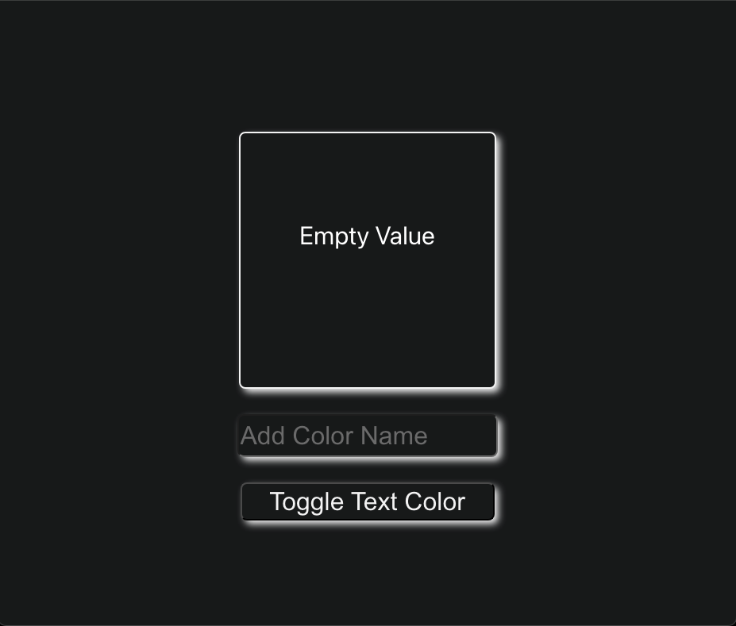
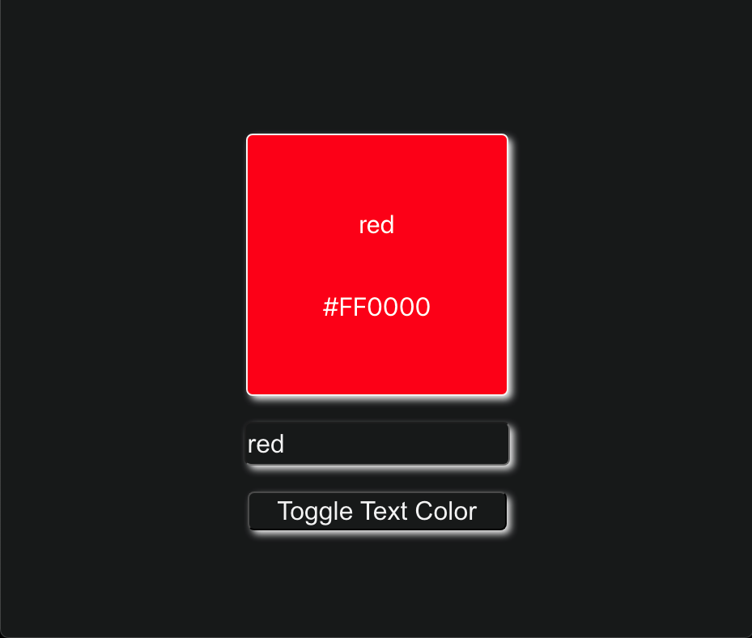
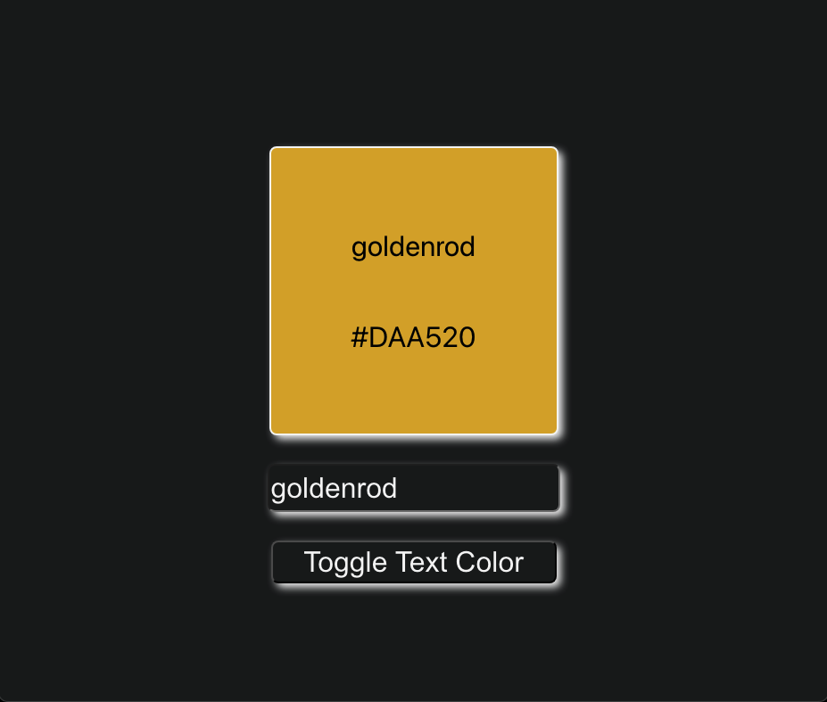

# React Color Box

A simple color box application built with React. 

This project allows users to select colors and apply them to a box, demonstrating the use of state and props in a React application.





## Features

- Display the hex value of colors upon selection
- Apply selected color to a box
- Dynamic update of the box color

## Getting Started

### Prerequisites

- [Node.js](https://nodejs.org/)
- [npm](https://www.npmjs.com/) or [yarn](https://yarnpkg.com/)

### Installation

1. **Clone the repository:**
    ```sh
    git clone https://github.com/yourusername/react-color-box.git
    ```
2. **Navigate to the project directory:**
    ```sh
    cd react-color-box-test-master
    ```
3. **Install dependencies:**
    ```sh
    npm install
    ```
    or
    ```sh
    yarn install
    ```

### Usage

1. **Start the development server:**
    ```sh
    npm start
    ```
    or
    ```sh
    yarn start
    ```
2. Open the application in your web browser at `http://localhost:3000`.
3. Use the color palette to select a color.
4. The selected color will be applied to the box.

## File Structure
```plaintext
react-color-box-test-master/
├── .gitignore
├── README.md
├── package-lock.json
├── package.json
├── .vscode/
│   └── settings.json
├── assets/
│   └── img/
│       ├── Color Box.png
│       ├── Color Box Red.png
│       └── Color Box Golden Rod.png
├── public/
│   ├── favicon.ico
│   ├── index.html
│   ├── logo192.png
│   ├── logo512.png
│   ├── manifest.json
│   └── robots.txt
└── src/
    ├── App.css
    ├── App.js
    ├── App.test.js
    ├── Button.js
    ├── ColorPalette.js
    ├── ColorSelector.js
    ├── colors.js
    ├── index.css
    ├── index.js
    ├── logo.svg
    ├── reportWebVitals.js
    └── setupTests.js
```

- **.gitignore**: Specifies files to be ignored by Git.
- **README.md**: The readme file for the project.
- **package-lock.json**: Automatically generated file that contains information about the dependency tree.
- **package.json**: Contains the metadata for the project and dependencies.
- **.vscode/**: Contains settings for VS Code.
- - **assets/**: Contains images for the application.
  - **img/**: Images used in the application.
- **public/**: Contains public assets and the main HTML file.
  - **favicon.ico**: The favicon for the application.
  - **index.html**: The main HTML file for the application.
  - **logo192.png**: A React logo used in the application.
  - **logo512.png**: A larger version of the React logo.
  - **manifest.json**: Provides metadata for the application (used in PWA).
  - **robots.txt**: Instructions for web crawlers.
- **src/**: Contains the source code for the application.
  - **App.css**: CSS file for styling the App component.
  - **App.js**: The main App component.
  - **App.test.js**: Test file for the App component.
  - **Button.js**: A reusable button component.
  - **ColorPalette.js**: Component for displaying the color palette.
  - **ColorSelector.js**: Component for selecting a color.
  - **colors.js**: Contains the color data used in the application.
  - **index.css**: Global CSS file.
  - **index.js**: Entry point for the React application.
  - **logo.svg**: SVG version of the React logo.
  - **reportWebVitals.js**: For measuring performance of the app.
  - **setupTests.js**: Configuration for running tests.

## Contributing

Contributions are welcome! Please open an issue or submit a pull request for any changes or enhancements.

## License

This project is licensed under the MIT License. See the [LICENSE](LICENSE) file for details.

## Contact

For any inquiries, please reach out to:

- Dave - [davejtake2@gmail.com](mailto:davejtake2@gmail.com)
- GitHub: [DaveJamieson](https://github.com/DaveJamieson)


# Getting Started with Create React App

This project was bootstrapped with [Create React App](https://github.com/facebook/create-react-app).

## Available Scripts

In the project directory, you can run:

### `npm start`

Runs the app in the development mode.\
Open [http://localhost:3000](http://localhost:3000) to view it in your browser.

The page will reload when you make changes.\
You may also see any lint errors in the console.

### `npm test`

Launches the test runner in the interactive watch mode.\
See the section about [running tests](https://facebook.github.io/create-react-app/docs/running-tests) for more information.

### `npm run build`

Builds the app for production to the `build` folder.\
It correctly bundles React in production mode and optimizes the build for the best performance.

The build is minified and the filenames include the hashes.\
Your app is ready to be deployed!

See the section about [deployment](https://facebook.github.io/create-react-app/docs/deployment) for more information.

### `npm run eject`

**Note: this is a one-way operation. Once you `eject`, you can't go back!**

If you aren't satisfied with the build tool and configuration choices, you can `eject` at any time. This command will remove the single build dependency from your project.

Instead, it will copy all the configuration files and the transitive dependencies (webpack, Babel, ESLint, etc) right into your project so you have full control over them. All of the commands except `eject` will still work, but they will point to the copied scripts so you can tweak them. At this point you're on your own.

You don't have to ever use `eject`. The curated feature set is suitable for small and middle deployments, and you shouldn't feel obligated to use this feature. However we understand that this tool wouldn't be useful if you couldn't customize it when you are ready for it.

## Learn More

You can learn more in the [Create React App documentation](https://facebook.github.io/create-react-app/docs/getting-started).

To learn React, check out the [React documentation](https://reactjs.org/).

### Code Splitting

This section has moved here: [https://facebook.github.io/create-react-app/docs/code-splitting](https://facebook.github.io/create-react-app/docs/code-splitting)

### Analyzing the Bundle Size

This section has moved here: [https://facebook.github.io/create-react-app/docs/analyzing-the-bundle-size](https://facebook.github.io/create-react-app/docs/analyzing-the-bundle-size)

### Making a Progressive Web App

This section has moved here: [https://facebook.github.io/create-react-app/docs/making-a-progressive-web-app](https://facebook.github.io/create-react-app/docs/making-a-progressive-web-app)

### Advanced Configuration

This section has moved here: [https://facebook.github.io/create-react-app/docs/advanced-configuration](https://facebook.github.io/create-react-app/docs/advanced-configuration)

### Deployment

This section has moved here: [https://facebook.github.io/create-react-app/docs/deployment](https://facebook.github.io/create-react-app/docs/deployment)

### `npm run build` fails to minify

This section has moved here: [https://facebook.github.io/create-react-app/docs/troubleshooting#npm-run-build-fails-to-minify](https://facebook.github.io/create-react-app/docs/troubleshooting#npm-run-build-fails-to-minify)
